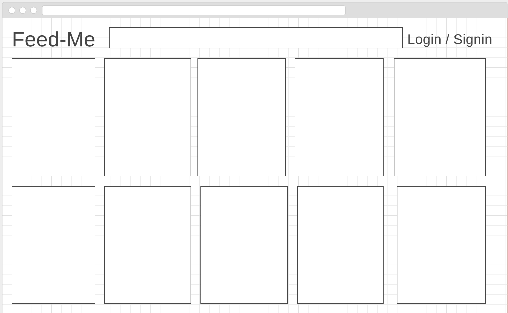
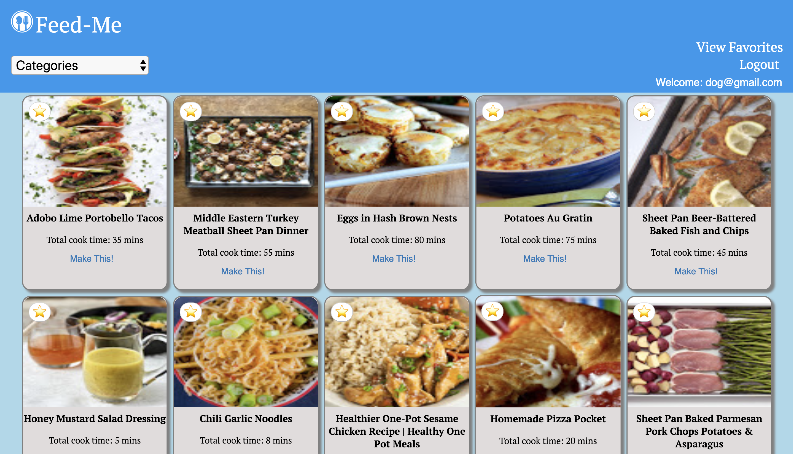

# Personal Project: Feed Me

This application fetches recipes from the Yummly API and displays the recipes. The user can favorite the recipes after they either create an account or login if they already have an account. The user can also filter through selected categories of recipes. This application was built in two weeks and uses the following frameworks and tools:

- React
- Redux
- Router
- Jest
- Enzyme
- Firebase

## Installation and Setup Instructions

- Clone down this repository. (https://github.com/nphan24/feed-me)
- npm install
- npm start
- visit localhost: 3000
- npm test 

You will need a key and an applcation Id from the [Yummly Api] (https://developer.yummly.com/). The key and applicationId needs to be stored in a file within src/Api/ApiCalls/apiKey.js under const apiKey and const applicationId.

## Project Screen Shots

## Contributors

Ngoc Phan (https://github.com/nphan24)
